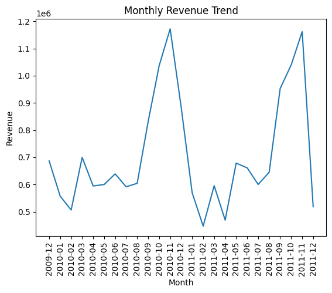
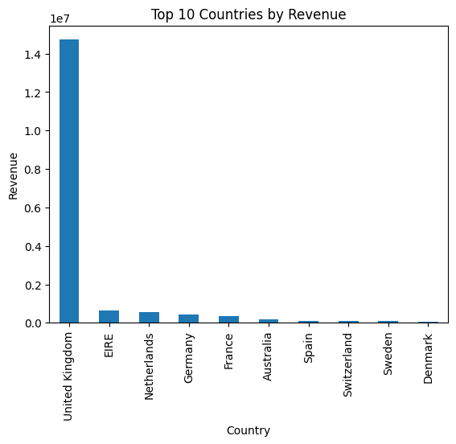
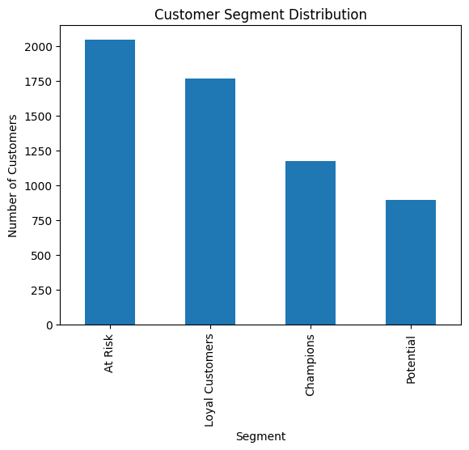
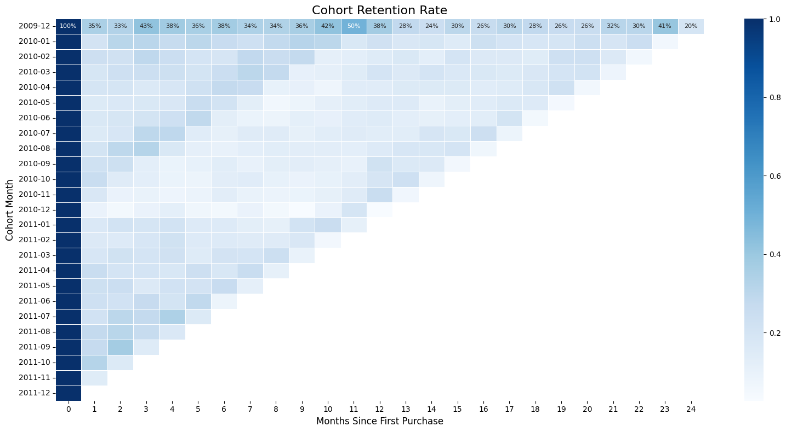
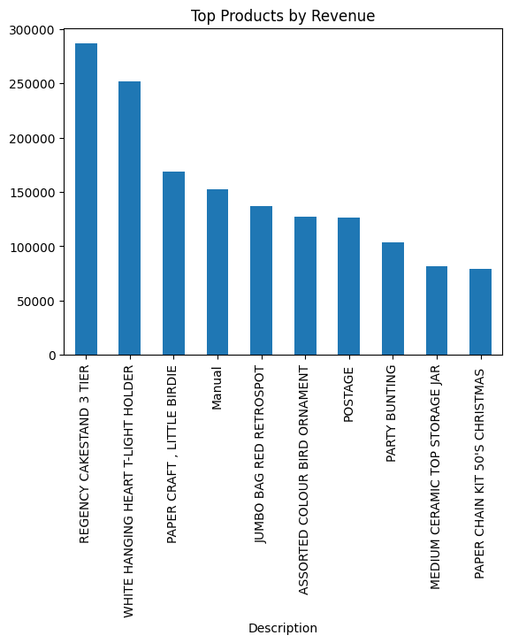
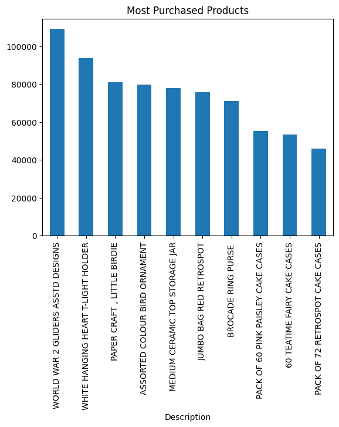
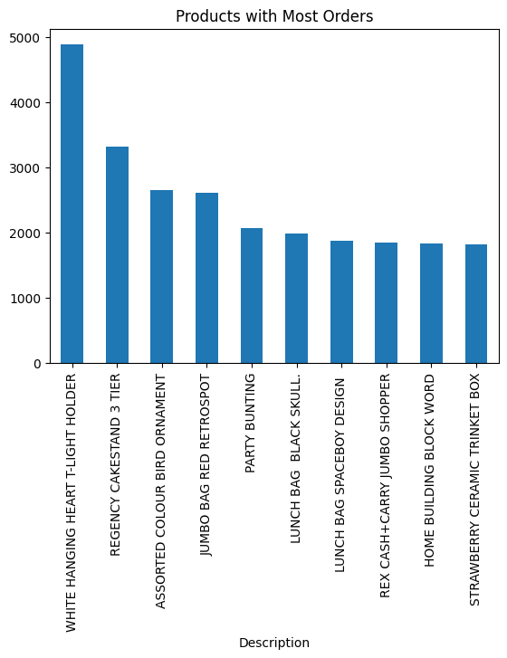
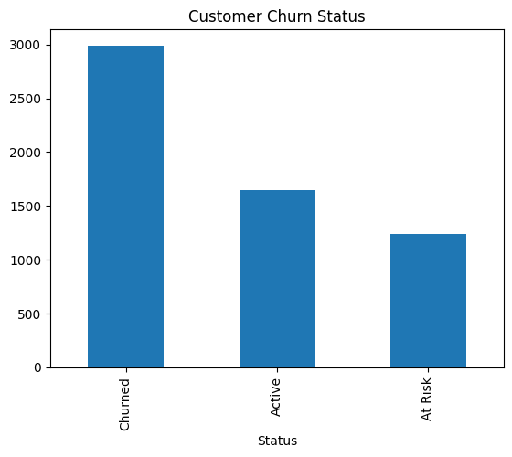
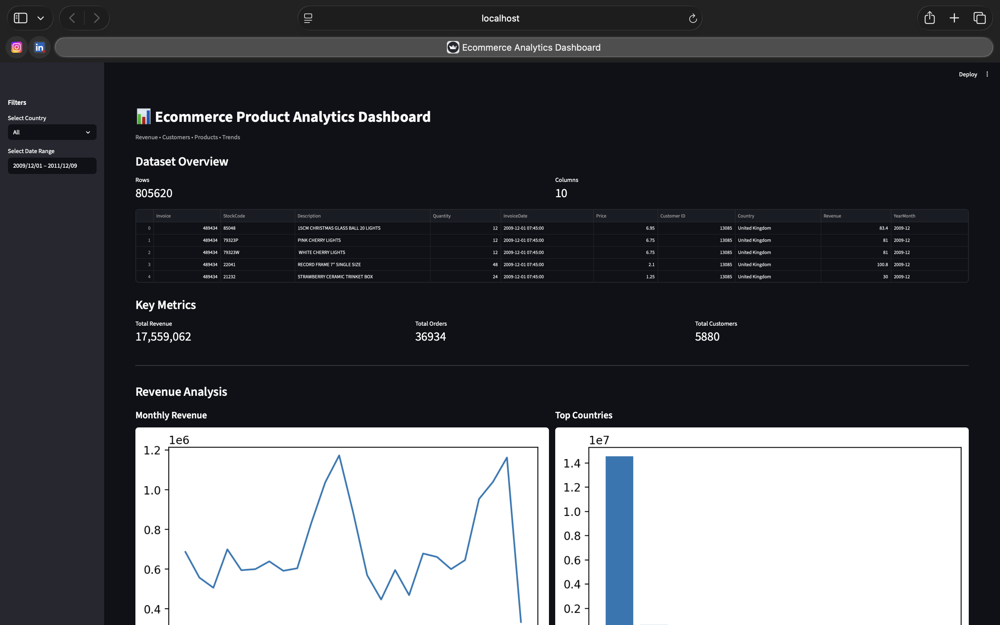

# E-Commerce Product Analytics & Customer Behavior Analysis

## 🎯 Business Context

As a Product/Data Analyst at an e-commerce company, this project aims to answer core growth and retention questions:

- Why are customers churning?
- What drives revenue growth?
- Which products generate repeat purchases?
- What is Customer Lifetime Value (CLV)?
- How can retention be improved?

## 📦 Dataset

**Source:** Online Retail II Dataset (UCI Machine Learning Repository)

**Primary fields:**

- `InvoiceNo`
- `CustomerID`
- `Quantity`
- `UnitPrice`
- `InvoiceDate`
- `Country`

## 🧰 Tech Stack

- Python (`pandas`, `numpy`)
- Data visualization (`matplotlib`, `seaborn`)
- SQL
- Jupyter Notebook
- Git/GitHub

## 📊 Analysis Scope

The project is organized around five analysis tracks:

1. Revenue Analysis
2. Customer Segmentation (RFM)
3. Cohort Retention Analysis
4. Customer Lifetime Value (CLV)
5. Business Recommendations

## 📁 Project Structure

```text
ecommerce-product-analytics/
├── README.md
├── requirements.txt
├── .gitignore
├── dashboard/
│   └── app.py
├── data/
│   ├── raw/
│   │   └── online_retail.csv
│   └── processed/
│       └── cleaned_online_retail.csv

├── notebooks/
│   ├── 01_data_inspection.ipynb
│   ├── 02_rfm_segmentation.ipynb
│   ├── 03_cohort_analysis.ipynb
│   ├── 04_CLV.ipynb
│   ├── 05_product_analysis.ipynb
│   └── 06_churn_analysis.ipynb

├── outputs/
│   ├── figures/
│   │   ├── monthly_revenue_trend.png
│   │   ├── top_countries_revenue.png
│   │   ├── rfm_customer_segments.png
│   │   ├── cohort_retention_heatmap.png
│   │   ├── top_products_revenue.png
│   │   ├── top_products_quantity.png
│   │   └── repeat_products.png
│
│   └── reports/
│       └── insights.md

├── sql/
│   └── analysis_queries.sql

├── src/
│   └── utils.py
```

## ✅ Expected Outcomes

- Clear view of sales and revenue patterns
- Customer segments based on purchase behavior
- Retention trends by customer cohort
- Practical CLV framework for prioritization
- Actionable recommendations to improve retention and growth

## Expected Outcomes

- Clear view of sales and revenue patterns
- Customer segments based on purchase behavior
- Retention trends by customer cohort
- Practical CLV framework for prioritization
- Actionable recommendations to improve retention and growth
- Identification of top-performing products and repeat purchase drivers

## 📊 Sample Visualizations

### Monthly Revenue Trend



### Top Countries by Revenue



### Customer Segmentation (RFM)



### Cohort Retention Heatmap



### Top Products by Revenue



### Most Purchased Products



### Repeat Purchase Products



### Customer Churn Status



## 📊 Streamlit Dashboard


